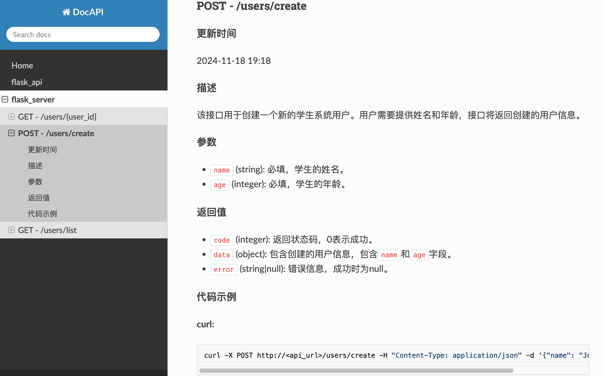

# 


[](https://pypi.org/project/docapi/)
[](https://github.com/Shulin-Zhang/docapi/pulls)

\[ 中文 | [English](README.md) \]

**DocAPI** 是一款基于大语言模型 (LLM) 的 API 文档生成工具，现支持 Flask 和 Django 框架。通过 DocAPI，您可以快速生成、更新并展示 API 文档，显著提高开发效率。

---

## 重要提示

- **1.x.x 版本** 相较 **0.x.x** 版本引入了重大变更，请参阅下方最新使用指南。
- 默认情况下生成或更新文档需要 API 服务的依赖环境
- 加参数--static为不依赖项目环境的静态路由扫描，只支持flask项目。缺点是可能把未使用的路由也生成到文档中，适合单页flask api项目。

---

## 核心功能

- **框架支持**：自动扫描 Flask 和 Django 服务的路由结构；
- **多模型兼容**：支持多种主流商业及开源大模型；
- **文档操作**：自动生成完整文档，局部更新文档；
- **多语言支持**：生成多语言 API 文档（需 LLM 支持）；
- **Web 展示**：支持通过 Web 页面展示 API 文档。

---

## 更新日志

- [2025-01-29]：.env文件默认从当前文件开始向上级搜索。
- [2025-01-24]：支持模型：Deepseek、Moonshot、Baichuan、Doubao。
- [2024-12-16]：生成、更新文档时显示进度条；flask项目支持不依赖项目环境的静态路由扫描。
- [2024-12-05]：全面支持 Django 3、4、5 版本并完成测试。
- [2024-12-02]：Windows 系统测试通过（需 PowerShell 或 Windows Terminal），优化模型名称管理，避免环境变量冲突。
- [2024-11-26]：支持 `.env` 文件加载环境变量及多国语言文档。
- [2024-11-24]：引入多线程加速请求处理。
- [2024-11-20]：新增自定义文档模板支持。
- [2024-11-17]：支持智谱 AI 和百度千帆模型，优化文档结构，新增 JavaScript 示例代码；移除配置文件执行模式。

---

## 安装

通过 PyPI 安装最新版本：

```bash
pip install -U docapi
```

安装带全部依赖的版本：

```bash
pip install -U "docapi[all]"
```

仅安装指定框架支持：

```bash
pip install -U "docapi[flask]"
```

```bash
pip install -U "docapi[django]"
```

**从 PyPI 官方源安装：**

```bash
pip install -U "docapi[all]" -i https://pypi.org/simple
```

**从 GitHub 安装：**

```bash
pip install git+https://github.com/NewToolAI/docapi
```

---

## 使用指南

以下为典型用法示例：

### OpenAI 模型示例

#### 1. 配置模型与密钥：
```bash
export DOCAPI_MODEL=openai:gpt-4o-mini

export OPENAI_API_KEY=your_api_key
```

#### 2. 生成文档：
- Flask 服务：
```bash
docapi generate server.py

# 静态路由扫描，不依赖项目环境
# docapi generate server.py --static
```

- Django 服务：
```bash
docapi generate manage.py
```

#### 3. 更新文档：
- Flask 服务：
```bash
docapi update server.py

# 静态路由扫描，不依赖项目环境
# docapi update server.py --static
```
- Django 服务：
```bash
docapi update manage.py
```

#### 4. 启动 Web 服务以展示文档：
```bash
docapi serve
```

### [更多用法请参阅](USAGE_zh.md)

---

## 支持模型

- OpenAI
- Azure OpenAI
- XAI
- 开源模型
- 百度千帆
- 通义千问
- 智谱 AI
- Deepseek
- (Kimi) Moonshot
- 豆包
- 百川

---

## 支持框架

- Flask (>=3.0.0)
- Django (3, 4, 5)

---

## 示例：API 文档 Web 页面



---

## TODO

- 支持更多大模型和 API 框架。
