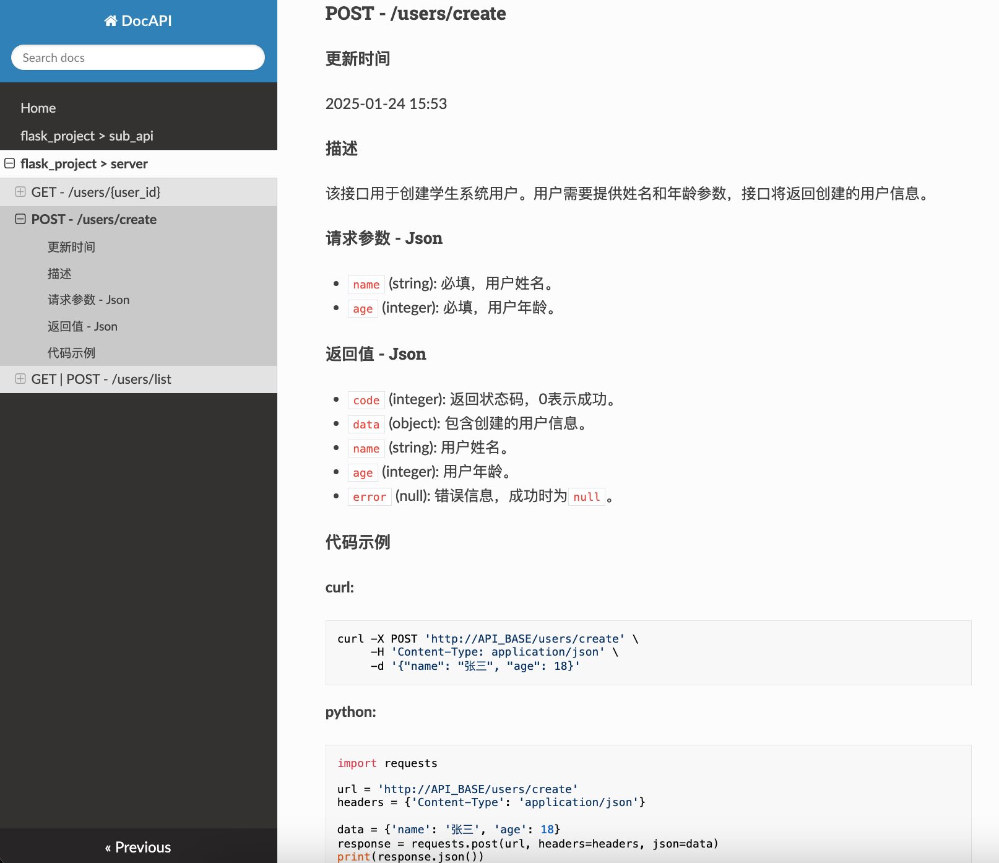

[](https://pypi.org/project/docapi/)
[](https://github.com/Shulin-Zhang/docapi/pulls)

\[ 中文 | [English](README.md) \]

DocAPI 是一个使用 LLM 自动生成 API 文档的 Python 包。

## 特性

- 对于Flask框架支持自动扫描API服务的路由结构；
  
- 支持多种国内外商业和开源模型；
  
- 支持自动生成文档和局部更新文档；

- 支持中文、英文文档；

- 支持web页面部署展示API文档。

## 安装

```bash
pip install docapi
```

或

```bash
pip install -U docapi -i https://pypi.org/simple
```

#### github源码安装

```bash
pip install git+https://github.com/Shulin-Zhang/docapi
```

## 使用方法

#### 方法一(推荐)

**自动扫描路由结构，只对flask项目有效，必须在api项目的环境中使用。**

OpenAI:
```bash
export OPENAI_API_KEY=api_key

export OPENAI_API_MODEL=gpt-4o-mini

# 生成文档
docapi generate server.py

# 更新文档
docapi update server.py

# 启动web服务
docapi serve
```

千问, 开源模型:
```bash
export OPENAI_API_KEY=api_key

export OPENAI_API_BASE=api_base_url

export OPENAI_API_MODEL=model_name

# 生成文档
docapi generate server.py

# 更新文档
docapi update server.py

# 启动web服务
docapi serve
```

百度千帆:
```bash
export QIANFAN_ACCESS_KEY=access_key

export QIANFAN_SECRET_KEY=secret_key

export QIANFAN_MODEL=ERNIE-3.5-8K

# 生成文档
docapi generate server.py

# 更新文档
docapi update server.py

# 启动web服务
docapi serve
```

智谱AI:
```bash
export ZHIPUAI_API_KEY=api_key

export ZHIPUAI_MODEL=glm-4-flash

# 生成文档
docapi generate server.py

# 更新文档
docapi update server.py

# 启动web服务
docapi serve
```

#### 方法二

**手动指定API服务服务文件列表，对任何框架都有效**

生成配置文件

```bash
docapi init
```

编辑`config.yaml`文件

```yaml
# API file list

api_files: 
  - 'flask_server.py'
  - 'flask_api.py'

# OpenAI

openai_api_key: xxx

openai_base_url: 'http://ip:port/v1'

openai_model: 'qwen-plus'

# Azure OpenAI

azure_api_key: null

azure_endpoint: null

azure_api_version: null

azure_model: null
```

```bash
# 生成文档
docapi generate --doc_dir ./docs --lang zh --config config.yaml

# 更新文档
docapi update --doc_dir ./docs --lang zh --config config.yaml

# 启动web服务
docapi serve ./docs -h 127.0.0.1 -p 9000
```

## 更新日志

- [2024-11-17] 支持智谱AI，百度千帆模型，优化文档结构，增加javascript代码示例。

## 支持模型

- OpenAI

- AzureOpenAI

- 通义千问

- 智谱AI

- 百度千帆

- 开源模型

## 支持API框架

- Flask
  
自动扫描只对Flask框架有效，推荐Flask服务上使用。

## API Web页面



## TODO

- ~~支持文心一言、智谱AI等大模型。~~

- 支持django框架的路由自动扫描。

- ~~支持文档在线web页面展示。~~

- 支持自定义文档模版。

- 多线程加速请求。

- 导入到postman。
